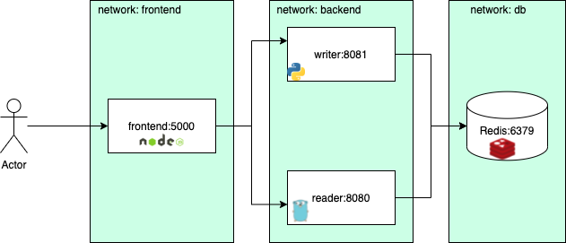

# Geral
- add .gitignore gerado no "gitignore.io"
- add ".editorconfig" ajuda a manter estilos de codificação consistentes para vários desenvolvedores trabalhando no mesmo projeto com IDEs e Sistemas Operacionais diferentes.
- add diagrama feito no draw.io para documentação, ajuda a resolver o problema bem mais rapidamente.


# service/frontend
  - alterado destino do codigo para "/app" no Dockerfile
```Dockerfile
ADD . /app
```

# service/reader
  - "main.go" linha 27 do serviço de GoLang estava errada recebendo um parametro a mais
```main.go
key := client.Get("SHAREDKEY")
```

# service/writer
  - no Docker file adicionar a dependência do Redis
```Dockerfile
RUN pip install redis
```


# Docker Compose
  - "redis" escrito errado
  - ajustar network frontend/backend/db
  - ajustar portas expostas dos serviços
  - ajustar ordem de subida dos container com "depends_on"
